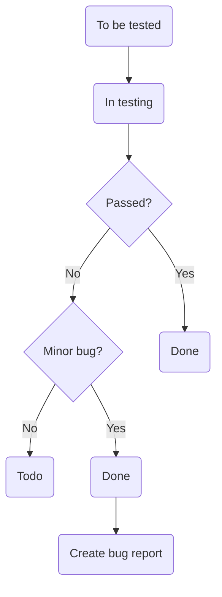

# BSWA 2023-2024 – [TrackMates](http://development.eu-central-1.elasticbeanstalk.com/) – Test Strategy

## 1. Introduction

The purpose of the test strategy for the **“TrackMates”** web and Progressive Web App (PWA) is to:

- Provide a central artifact to govern the strategic approach of the test effort; it defines the general approach to be employed when testing the software and when evaluating the results of that testing. Planning artifacts will refer to the test strategy regarding the governing of detailed testing work.
- Provide visible confirmation to test-effort stakeholders that adequate consideration has been given to governing the test effort and, where appropriate, to have those stakeholders approve the strategy.

### Analogues

[Way Of Life](https://wayoflifeapp.com/) - Habit Tracker

### Used technologies

- **Global:**
  TypeScript – extends JavaScript by adding types to the language
  npm workspaces – to manage multiple packages in a single repository

- **Frontend:**
  React – a frontend library
  Redux + Redux Toolkit – a state management library

- **Backend:**
  Fastify – a backend framework
  Knex – a query builder
  Objection – an ORM

- **Shared Package:**
  Zod – a schema validator

- **Database:**
  PostgreSQL – relational database management system

- **Artificial Intelligence:**
  OpenAI Node API Library – provides access to the OpenAI REST API

The project is deployed to AWS.

GitHub actions are used for CI and CD.

Scrum model is used for SDLC.

### Documents

[Design (Desktop)](https://www.figma.com/file/P8QzgCZEaN0UU9QpjdggRW/BSA_TrackMates?type=design&node-id=0%3A1&mode=design&t=isWb7Jwsid5AxTL1-1)

[Design (Mobile)](https://www.figma.com/file/JJjwl3joVKOwS0tzzYs8Vz/TrackMates?type=design&node-id=0%3A1&mode=design&t=ZuqmB1birN3911IH-1)

[Specification](https://docs.google.com/document/d/1Vum3p6bc_2BQ_t3YaJbaH1We7UoZx7Hztgm0kTCeEe4/edit?usp=sharing)

[Mind Map](https://miro.com/app/board/uXjVNuSbBvw=/?share_link_id=272684492193)

[Test Plan](https://github.com/BinaryStudioAcademy/bsa-winter-2023-2024-trackmates/blob/main/docs/test-plan.md)

### Project team

The team that will work on the project:

- developer team (9 members);
- QA team (2 members);
- 1 Team Lead;
- 2 coaches of the developer team;
- 2 coaches of the QA team;
- Product Owner.

### Project deadlines

09/02/2024 – project starts;

23/03/2024 – project release.

All works must be completed before 22/03/2024.

### Communications approach

QAs can communicate:

- with questions that arise during the development to coaches;
- with questions about the product to the product owner during the demo;
- with any technical questions to the development team.

## 2. Test Approach

A **proactive** approach will be used in the testing – an approach in which the test design process is initiated as early as possible in order to find and fix the defects before the build is created.

- Manual testing
- Automated testing (optional)

Automated testing will cover high-level features (only API tests should be automated).

### Types of Testing

The following types of testing will be used:

- Functional testing
- User interface testing
- Compatibility testing
- Sanity testing
- Regression testing
- Acceptance testing

### Priorities for test activities

1. Testing Process
2. Requirements Analysis
3. Test Documentation
4. Mind Maps, Mockups, etc.

### Weekly objectives for the QA team

**Week 1:** Testing Process, Requirements Analysis, Mind Map, Test Strategy

**Week 2:** Testing Process, Requirements Analysis, Test Plan, Test Cases

**Week 3:** Testing Process, Requirements Analysis, Test Cases

**Week 4:** Testing Process, Requirements Analysis…

**Week 5:** Testing Process, Requirements Analysis…

**Week 6:** Acceptance Testing, Requirements Analysis…

### Using templates

[Bug Report Template](https://github.com/BinaryStudioAcademy/bsa-winter-2023-2024-trackmates/issues/new?assignees=&labels=bug&projects=&template=bug-report.yml&title=fix%3A):

1. Title
2. Description
3. Steps to reproduce
4. Actual Result
5. Expected Result
6. Attachments
7. Environment
8. Severity

[Feature Request Template](https://github.com/BinaryStudioAcademy/bsa-winter-2023-2024-trackmates/issues/new?assignees=&labels=feature+request&projects=&template=feature-request.yml&title=feat%3A):

1. Title
2. Description
3. Attachments

## 3. Test Environment

- **Setup required for the test environment:**

  - Platforms:
    - Windows 10 x64 22H2 (10.0.x.x)
    - macOS Sonoma 14.3.1
    - Android 12
    - iOS 17.3.1
  - Browsers:
    - Chrome 122.x.x.x (Windows, macOS)
    - Firefox 123.0 (Windows)
    - Safari 17.0 (macOS)
  - Mobile testing devices:
    - Samsung Galaxy S10
    - iPhone 15 Pro Max
  - Display resolutions: 1920x1080, 1440x900
  - Width breakpoints: 1024px, 768px, 480px
  - Display orientations: landscape, portrait
  - Localization of the project: English
  - Tools:
    - GitHub Board
    - Google Docs
    - Qase
    - Figma
    - DevTools
    - Swagger
    - Postman
  - Responsive web design tools:
    - Chrome DevTools Device Toolbar
    - Firefox DevTools Responsive Design Mode
    - Safari Responsive Design Mode

- **Environments defined for the project:**
  - [Local environment](https://github.com/BinaryStudioAcademy/bsa-winter-2023-2024-trackmates)
  - [Test environment](http://development.eu-central-1.elasticbeanstalk.com/)

## 4. Testing Tools and Artifacts

### Testing artifacts for the Project:

All artifacts, including this Test Strategy, should be placed in the **/docs** directory of the project repository:

- [Test Plan](https://github.com/BinaryStudioAcademy/bsa-winter-2023-2024-trackmates/blob/main/docs/test-plan.md)
- [Mind Map](https://miro.com/app/board/uXjVNuSbBvw=/?share_link_id=272684492193)
- Check-list
- Test Cases
- Bug Reports

### Defect Life Cycle:

**Severity:**

Blocker (S1) – Blocker Impact / System Down. Complete system outage.

Critical (S2) – Critical Impact / Partial system outage.

Major (S3) – Significant Impact / Severe downgrade of services.

Minor (S4) – Minor Impact / Most of the system is functioning properly.

Trivial (S5) – Low Impact / Informational.

### Automated testing:

Optional automated testing may be implemented for previous sprints.

For that, TypeScript, Mocha and Chai should be used.

GitHub actions are used for CI/CD.

## 5. Release Control

The project workspace is organized on the GitHub project board. GitHub is used as a code hosting platform for version control and collaboration for this project.

### Testing entry criteria:

- the testing process begins at the requirements analysis stage,
- control of the design process at the stage of developing a system project,
- fulfillment of acceptance criteria of the tickets.

### Testing exit criteria:

- all works must be completed not later than: 22/03/2024,
- not less than 95% of found defects, all defects with blocking, critical and high severity must be fixed, which ensures comprehensive approach to defect resolution, covering various aspects of the system's functionality, usability and compatibility, and aims to minimize the presence of critical and high-severity defects that could potentially impact the system's functionality, user experience, or overall quality,
- management decision.

## 6. Additional Procedures

**To improve the testing process next additional procedures are needed:**

### Meetings:

- Daily SCRUM team meeting – 9:15 a.m.;
- QA mentor meeting – 2 times a week;
- QA team meeting (optional) – daily;
- Demo with PO.

### Work review:

- Weekly review of test artifacts with QA mentor.

### Testing team:

Responsibilities of each QA team member:

- writing test documentation;
- requirements analysis;
- manual testing;
- API testing (manual and automated);
- reporting bugs and errors to the development team.

The master branch must be frozen at least one day before demo each sprint.

## 7. Common risks

### SDLC Risks:

| Risk                           | Action point                                                                                                                                       | Responsible |
| ------------------------------ | -------------------------------------------------------------------------------------------------------------------------------------------------- | ----------- |
| Absence of team member         | Provision has to be made for the temporary assignment of duties to another competent specialist. Correct planning of all processes                 | Coaches     |
| Your absence                   | To inform the team about your absence as soon as possible in Slack, provide information about your urgent tasks                                    | QA          |
| Faulty test results            | Implement peer reviews and validation checks to verify the accuracy of test results before finalizing them. Analyze a problem, create a bug report | QA Team     |
| Test environment not available | Inform JS Coach on Slack, execute the testing process locally                                                                                      | JS Coach    |
| Not enough time for testing    | Prioritize testing activities based on critical functionalities and allocate additional resources or extend timelines if necessary                 | QA Team     |

### Project Implementation Risks:

- Technical Complexity: Developing a web and Progressive Web App (PWA) may introduce technical challenges, such as ensuring cross-browser compatibility, offline functionality, and responsiveness across various devices
- Resource Allocation: Short project timeframe requires efficient resource allocation and coordination to meet deadlines and deliver high-quality results

## 8. Test Plan

**[Test Plan](https://github.com/BinaryStudioAcademy/bsa-winter-2023-2024-trackmates/blob/main/docs/test-plan.md)** is composed by the QA team and contains:

1. Feature priorities
2. Team availability hours
3. Test approach (backend / frontend decomposition)
4. What will we automate? On what level?
5. Features planned
6. Features implemented
7. Demo date / final scope
